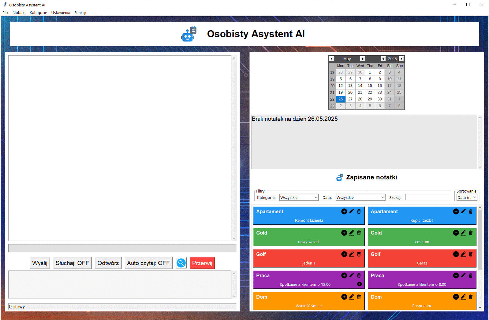

# 🧠✨ Your Personal AI Assistant: Offline (Polish UI) 📝
_An AI-powered personal assistant built with Python, Ollama (local LLM), Vosk (offline speech recognition), and Tkinter for a rich GUI. Features chat, note-taking, voice interaction, data visualization, and robust security for 100% offline and private operation, with a **Polish user interface**._

[-lightgrey.svg)](#-license)
[](https://www.python.org/)
[]()
[-blue.svg)]()
[-green.svg)]()
[]()
[]()
[](https://matplotlib.org/)
[](https://www.sqlite.org/)


<p align="center">
  <!-- Add a graphics/banner.png here if you create one for the repository -->
  <!--  -->
</p>


<div align="center">
  <strong>🤖 Built with Python · Ollama · Vosk · Tkinter 🛡️</strong><br>
  <strong>✨ 100% Offline · 100% Private · 100% Yours ✨</strong>
</div>

## 🎞️ Demo
<p align="center">
  
</p>

## 📋 Table of Contents
1.  [Overview](#overview)
2.  [Key Features](#key-features)
3.  [Screenshots](#screenshots)
4.  [System Requirements](#system-requirements)
    *   [Operating System](#operating-system)
    *   [Python Version](#python-version)
    *   [Python Libraries](#python-libraries)
5.  [Installation Guide](#installation-guide)
6.  [Running the Application](#running-the-application)
7.  [Using the Application (Polish UI)](#using-the-application-polish-ui)
    *   [Login](#login)
    *   [Main Interface (Polish Labels)](#main-interface-polish-labels)
    *   [Voice Commands (Polish UI for controls)](#voice-commands-polish-ui-for-controls)
    *   [Attachments (Polish UI for controls)](#attachments-polish-ui-for-controls)
    *   [Export/Import Notes (Polish UI for menu items)](#exportimport-notes-polish-ui-for-menu-items)
    *   [Charts & Statistics (Polish UI for menu items)](#charts--statistics-polish-ui-for-menu-items)
    *   [Startup with Windows (Polish UI for settings)](#startup-with-windows-polish-ui-for-settings)
8.  [Security](#security)
9.  [Customization](#customization)
10. [Troubleshooting](#troubleshooting)
11. [Project File Structure (Expected)](#project-file-structure-expected)
12. [Credits & Technologies](#credits--technologies)
13. [Contributing](#contributing)
14. [License](#license)
15. [Author & Contact](#author--contact)

## 📄 Overview

This **Personal AI Assistant** is a sophisticated desktop application for Windows, meticulously crafted by Adrian Lesniak. It serves as an intelligent companion to help manage your daily productivity through note-taking, category organization, daily plan generation, and much more, with a **user interface primarily in Polish**. The assistant operates **offline**, leveraging local Large Language Models (LLMs) via **Ollama** for its AI chat capabilities (e.g., "Eliza" persona or the Polish "bielik" model) and **Vosk** for offline speech recognition. It features a modern, responsive Graphical User Interface (GUI) built with **Tkinter**, complete with animated backgrounds and custom icons. Advanced functionalities include attaching files to notes, visualizing data with statistics and charts (using Matplotlib), and ensuring your data's security with encrypted password protection.

## ✨ Key Features

*   💬 **AI Chat**: Engage in natural, context-aware conversations with an AI assistant (e.g., "Eliza" or a local Polish LLM like "bielik" via Ollama).
*   📝 **Comprehensive Note Management (Polish UI)**:
    *   Create, read, update, and delete notes.
    *   Efficiently search through your notes using a "Lupa" (magnifying glass) tool.
    *   Organize notes into user-defined categories ("Kategorie").
*   📂 **Category Management (Polish UI)**: Add, remove, and list categories for better organization.
*   📎 **File Attachments**: Attach various file types (images, PDFs, documents) directly to your notes and open them from within the application.
*   📅 **Daily Plan Generator**: Automatically create a suggested daily schedule or to-do list based on your notes.
*   📊 **Statistics & Charts**: Visualize your note-taking habits and data distribution with:
    *   Pie charts (e.g., notes by category).
    *   Timeline charts (e.g., note creation over time).
    *   Monthly activity breakdown charts. (Accessible via "Funkcje" menu).
*   🗓️ **Calendar Integration**: View and access notes associated with specific dates using an interactive calendar widget (`tkcalendar`).
*   🗣️ **Voice Control & Interaction (Polish UI for controls)**:
    *   **Speech Recognition (Vosk + PyAudio)**: Dictate commands, chat messages, or note content using your microphone. Activate with "Nasłuchuj: ON" (Listen: ON).
    *   **Text-to-Speech (pyttsx3)**: Have the AI assistant's responses or note content read aloud using "Czytaj" (Read) or "Auto czytanie" (Auto-read) options.
*   🔒 **Password Protection & Encryption**:
    *   Secure your entire notes database and application access with a user-defined password.
    *   Passwords are encrypted using the `cryptography` library.
*   🔄 **Data Export/Import (Polish UI for menu items)**: Backup your notes to a JSON file (`notes_export.json`) and restore them when needed.
*   🚀 **Windows Startup Option**: Configure the application to optionally start automatically when Windows boots up (managed via `winreg`).
*   🎨 **Modern & Responsive UI (Tkinter)**:
    *   A user-friendly and visually appealing interface with Polish labels and buttons.
    *   Resizable window with dynamic elements.
    *   Features animated backgrounds and custom icons (e.g., `przy1.png`, `lupa.png`).
*   🌐 **Offline Operation**: All core features, including AI chat (with a local Ollama model) and speech recognition (with a local Vosk model), are designed to work completely offline.

## 🛠️ System Requirements

### Operating System
*   **Windows 10/11** (Primary target, especially for features like Windows Registry for autostart).
*   *(Some features might work on Linux/macOS with modifications, but full compatibility, especially for UI elements and system integration, is Windows-focused).*

### Python Version
*   Python **3.8 or newer**.

### Python Libraries
*   `tkinter` (Usually included with standard Python installations)
*   `sqlite3` (Included with standard Python)
*   `json`, `os`, `sys`, `datetime`, `random`, `base64`, `hashlib` (Standard Python libraries)
*   `ollama` (For interacting with local LLMs)
*   `vosk` (For offline speech recognition)
*   `pyaudio` (For microphone input, required by Vosk)
*   `pyttsx3` (For text-to-speech functionality)
*   `Pillow` (PIL Fork, for image handling, e.g., background, icons)
*   `tkcalendar` (For the interactive calendar widget in Tkinter)
*   `cryptography` (For secure password encryption)
*   `matplotlib`, `numpy` (For generating charts and numerical operations)
*   `winreg` (Standard on Windows, for interacting with the Windows Registry for autostart feature)

> **Note:** You will need to install most of these external libraries via pip. It's highly recommended to use the provided `requirements.txt` file.

## ⚙️ Installation Guide

1.  📁 **Clone or Download the Repository**:
    ```bash
    git clone <this-repo-url> 
    # Example: git clone https://github.com/yourusername/personal-ai-assistant.git
    cd personal-ai-assistant
    ```
    *(Or download and extract the ZIP archive of the project).*

2.  📦 **Set Up a Virtual Environment & Install Python Dependencies**:
    It is strongly recommended to use a Python virtual environment:
    ```bash
    python -m venv venv
    # On Windows:
    venv\Scripts\activate
    # On macOS/Linux:
    # source venv/bin/activate
    ```
    Create a `requirements.txt` file in the project root with the following content if one isn't already provided:
    ```txt
    ollama
    vosk
    pyaudio
    pyttsx3
    Pillow
    tkcalendar
    cryptography
    matplotlib
    numpy
    ```
    Then, install all dependencies:
    ```bash
    pip install -r requirements.txt
    ```

3.  🗣️ **Download Vosk Speech Recognition Model**:
    *   Go to the Vosk Models page: [https://alphacephei.com/vosk/models](https://alphacephei.com/vosk/models)
    *   Download a suitable **English** model (e.g., `vosk-model-small-en-us-0.15`) or a **Polish** model if you intend to adapt the speech recognition for Polish. The overview states "English-speaking AI assistant" for chat, but voice commands could be different. *Clarify if Polish Vosk model is also needed.*
    *   Extract the downloaded archive.
    *   Create a folder named `model/` in your project's root directory.
    *   Place the extracted Vosk model folder (e.g., `vosk-model-small-en-us-0.15/`) **inside** this `model/` directory.

4.  🧠 **Install Ollama and Download LLM Model**:
    *   **Install Ollama**: Download and install Ollama for your operating system from the [official Ollama website](https://ollama.com/).
    *   **Download a Compatible LLM**: After installing Ollama, open your terminal or command prompt and pull the "SpeakLeash/bielik" model (a Polish LLM) or a suitable English LLM if the AI chat is purely English.
        ```bash
        ollama pull SpeakLeash/bielik-11b-v2.3-instruct:Q4_K_M 
        # OR, for a general English model:
        # ollama pull llama2:7b 
        ```
        *(Refer to the [Ollama Model Library](https://ollama.com/library). The choice depends on the primary language of AI interaction intended).*
    *   **Ensure Ollama Server is Running**: Before starting the Personal AI Assistant, the Ollama server must be running.

5.  🎨 **Prepare Graphics**:
    *   Ensure you have a `graphics/` folder in your project's root directory.
    *   Place all required image and icon files inside this `graphics/` folder:
        *   `logo.png`
        *   `background.gif` or `background.jpg`
        *   `attach.png`
        *   `edit.png`
        *   `delete.png`
        *   `przy1.png` (Polish named icon)
        *   `lupa.png` (magnifying glass/search icon)
    *   **Recommended for GitHub**: Add a `graphics/banner.png`.

## 🚀 Running the Application

1.  Ensure all installation steps are completed.
2.  Verify that the **Ollama server is running**.
3.  Navigate to the project's root directory in your terminal.
4.  If using a virtual environment, activate it.
5.  Run the main application script:
    ```bash
    python main.py
    ```

## 🧑‍💼 Using the Application (Polish UI)

### Login
*   **First Run**: Upon the very first launch, use the default password: `admin`.
*   **Security**: **Change this default password immediately** via the "Ustawienia" (Settings) menu.

### Main Interface (Polish Labels)
*   **Left Panel (Lewy Panel)**: Chat with "Eliza," view today's notes ("Notatki na dziś"), use input box for commands/questions.
*   **Right Panel (Prawy Panel)**: Browse notes by category ("Kategorie"), date (using the "Kalendarz"), or search.
*   **Top Menu Bar (Menu Górne)**: Access note/category management, statistics ("Statystyki"), charts ("Wykresy"), settings ("Ustawienia"), and file operations ("Plik" -> Export/Import).

### Voice Commands (Polish UI for controls)
*   Click **"Nasłuchuj: ON"** (Listen: ON) to dictate.
*   Use **"Czytaj"** (Read) or **"Auto czytanie"** (Auto read) for text-to-speech.

### Attachments (Polish UI for controls)
*   Add files to notes via the attachment button (likely with `attach.png` icon) on each note tile or in the note editing window.

### Export/Import Notes (Polish UI for menu items)
*   Backup notes to `notes_export.json` or restore from it via the "Plik" (File) menu.

### Charts & Statistics (Polish UI for menu items)
*   View visualizations of your notes via the "Funkcje" (Functions) or "Statystyki" (Statistics) menu.

### Startup with Windows (Polish UI for settings)
*   Enable or disable autostart in the "Ustawienia" (Settings) menu.

## 🔐 Security

*   **Passwords**: User passwords for application access are **encrypted** using the `cryptography` library and stored in a hidden folder in your user directory.
*   **Local Data**: All notes and application data are stored locally in an SQLite database file named `notes.db`.
*   **Recommendation**: Change your application password regularly.

## 🧩 Customization

*   🔁 **AI Model (Ollama)**: Modify the Python code to use a different Ollama model (e.g., an English-focused LLM if Eliza's responses are in English, or ensure "bielik" is configured for desired interaction language).
*   🎨 **Graphics & Icons**: Replace image files in the `graphics/` folder.
*   🌍 **Language**: The application UI is primarily in Polish. The AI assistant is described as "English-speaking," which might be a configuration for Eliza's persona interacting with the Ollama model. Adapting the UI to other languages would require translating string literals in the Python/Tkinter code.

## 🧰 Troubleshooting

| Issue                        | Solution                                                                                                                                                              |
| :--------------------------- | :-------------------------------------------------------------------------------------------------------------------------------------------------------------------- |
| 🎤 Microphone Not Detected   | Check system microphone settings, ensure correct device selection, update audio drivers. Test in another app. Verify `pyaudio` installation. |
| 🧠 Ollama Not Running / Errors | Ensure Ollama server is running (`ollama serve` or Ollama desktop app). Check Ollama logs. Ensure the chosen LLM model is pulled and available. |
| 🖼️ Missing Models/Graphics   | Verify Vosk model in `model/` and all images in `graphics/` are correctly placed with correct filenames. |
| 🔒 Permission Issues        | For autostart or file saving issues, try running Python as administrator (use with caution). Ensure write permissions for the application directory and user's hidden folder for password storage. |

## 🗂️ Project File Structure (Expected)

*   `main.py`: Main Python script (Tkinter GUI, core logic).
*   `model/`: Directory for the Vosk speech recognition model.
    *   `vosk-model-small-en-us-0.15/` (or similar)
*   `graphics/`: Directory for UI image assets.
    *   `logo.png`
    *   `background.gif` (or `background.jpg`)
    *   ... (other `.png` files)
*   `notes.db`: SQLite database file (created at runtime) storing user notes, categories, and encrypted password.
*   `notes_export.json`: Default filename for exported notes.
*   `requirements.txt`: Lists Python package dependencies.
*   `README.md`: This documentation file.
*   (Potentially other `.py` modules for better organization).

## 📜 Credits & Technologies

*   **Author**: Adrian Lesniak
*   **Core AI Model Interaction**: [Ollama](https://ollama.com/) (with models like [SpeakLeash/bielik-11b-v2.3-instruct](https://ollama.com/library/speakleash/bielik) or other suitable LLMs)
*   **Speech Recognition**: [Vosk Offline Speech Recognition](https://alphacephei.com/vosk/)
*   **GUI Framework**: Tkinter (Python standard library), tkcalendar
*   **Text-to-Speech**: pyttsx3
*   **Image Handling**: Pillow
*   **Charting**: Matplotlib, NumPy
*   **Encryption**: cryptography library

## 📃 License

All rights reserved © 2024 Adrian Lesniak

*This implies a proprietary license. If you intend for others to use, modify, or distribute your code more broadly, please consider adopting an open-source license (e.g., MIT, GPLv3) and add a `LICENSE` file to your repository.*
*If you wish to contribute, request features, or build upon this project for purposes beyond personal use, please contact the author.*

## 📧 Author & Contact

*   **Author**: Adrian Lesniak
*   **Email**: `adr.lesniak@gmail.com`

For questions, suggestions, or bug reports, please use the email above or open an issue on the GitHub repository if one is available.

---
